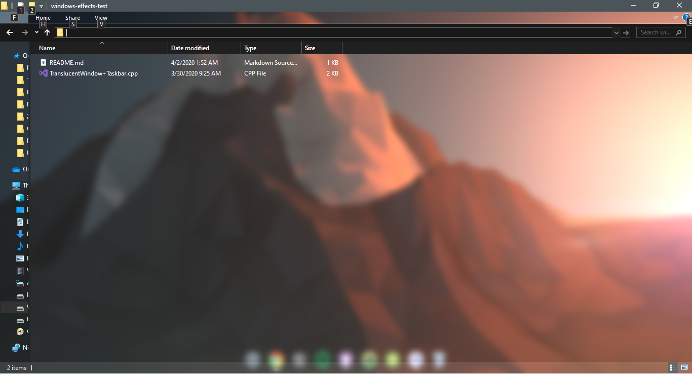

# windows-effects-test
A project aimed at modifying Windows 10 look and feel using Win32 APIs and some good ideas. The project is based on some help from the TranslucentTaskbar project by ishu3101. Link: https://gist.github.com/ishu3101/830b556b487de5d69690

# Note:
This is not complete by any means, code is not clean and not documented. This is just a little start. [Abandoned project due to busyness]

## Test Run of Translucency Effect on Windows Explorer:

